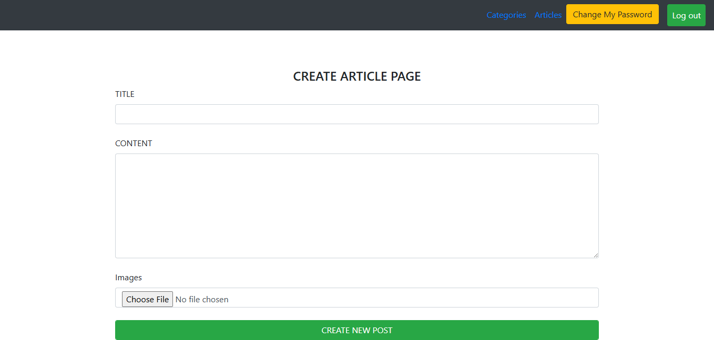

PHP Blog System

Overview

PHP Blog System is a simple blogging application built using PHP and MySQL.

It includes three user roles: Admin, Author, and User, each with different permissions and access levels.

------------------------------------------

Key Features

(Admin) 

Dashboard

View all posts

Delete posts

Add and delete categories

Manage authors and users

View and manage reports submitted by users

------------------------

(Author Features)

Create blog posts

Update their own posts

------------------------

(User Features)

View articles

Report inappropriate or spam content

------------------------------------------

(Tech Stack)

Backend: PHP (Core PHP)

Frontend: HTML, CSS, Bootstrap

Database: MySQL

Server: Apache (XAMPP / WAMP / Laragon)

------------------------------------------

(Installation)

1. Download or Clone the Project

Place the project folder inside:

htdocs/   (XAMPP)

2. Database Setup

Open phpMyAdmin
http://localhost/phpmyadmin

Create a database named:

db

Import the SQL file:

db.sql

3. Configure Database (if needed)

Open the file:

config.php

Ensure the following configuration:

$host = "localhost";
$user = "root";
$pass = "";
$db   = "db";

Running the Project

Open the project in your browser:

http://localhost/Blog-project-php-/

------------------------------------------

Login Credentials

(Admin)

Email: admin@gmail.com

Password: 1234

------------------------

(Author)

Email: author@gmail.com

Password: 1234

------------------------
(User)

Email: user@gmail.com

Password: 1234

------------------------------------------

Screenshots

Admin Pages

------------------------------------------
------------------------------------------

User Pages

------------------------------------------
------------------------------------------

Author Pages

